# Game Design Document

This document is a placeholder for the Game Design Document to be developed in the Year 12 ISD class in Semester 1, 2023.

## Contributors
RC
Samuel Allen
Matthew Seebohm

# Lights Out

## TOC

TBD

## Premise

Max (the name for the player character) was a successful businessman who lived a comfortable life with his family. One day, he was suddenly kidnapped by a criminal organisation and woke up in a dark basement with no memory of how he got there. To his shock, he discovered that he had lost his sight, but in its place, he gained the ability to see sounds as blue waves along the surface.

Upon discovering this power, Max used sound sources around him to solve puzzles and escape the basement. From escaping the basement, Max comes into close contact with the mafia in a separate room, discussing their nefarious plans of illegal activities, and Max soon encounters yet more puzzles.

At the end of all the puzzles, the player taking on the role as Max soon reaches a door that temporarily blinds the player in a fade-in white, thereby ending the game by successfully escaping the mafia hideout. A roll of credits plays at moderate speed listing the names of the developers and references. The game then returns to the main menu scene. The credits scene can be replayed from a button on the main menu.

## Inspiration/Similarities

The main draw of inspiration for this concept was from “Stifled”, using a similar way to portray echolocation and kind of a horror/mystery theme. “Stifled: is a single player survival horror (with the option of vr) that does well in developing the gameplay around the lack of visibility, challenging the player to take advantage of what little support they have. But fails in creating a virtual reality experience that takes advantage of the pros of vr. This is why we wanted to develop a game that applied the conventions of echolocation and vr, while challenging the player with puzzles that build around the abilities of both

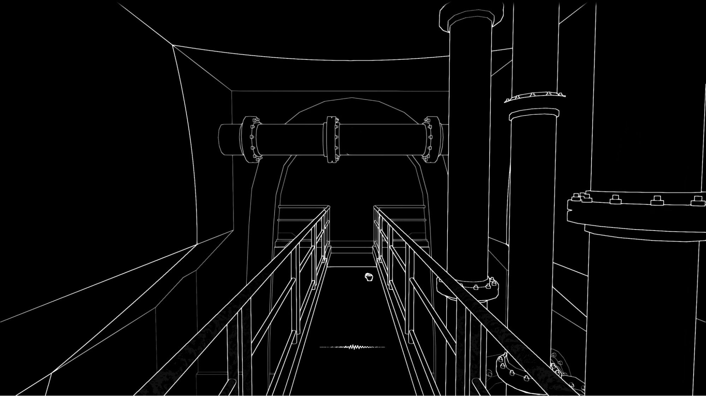

Stifled (Singleplayer, First Person and VR)
https://store.steampowered.com/app/514830/Stifled__Echolocation_Horror_Mystery/

# Scenes Needed

|||
|--|--|
|||
|The mafia discussion table, with the player eavesdropping on their conversation (after first level). The sounds they make from talking should give the player a rough analysation of who their captors are and where the player is. This will be how the player realises they are in a mafia base. | The main menu scene still needs to be made. The background is undecided, but is likely to include Max (the player character) or the basement environment (the first level).|
|In game menu ||

## Gameplay

Gameplay consists of an escape room/scavenger hunt where the player has to search for a way out through the dark, using only sound and echolocation as a means of visibility.

The player first appears in the first room (unknown to them due to the inability to see). Water droplets fall from the ceiling displaying the ring of light that allows the player to see a locked door and a key hidden within a hole in the wall. The key shines brighter than normal, urging the player to interact with it. Unlocking the door with the key causes a clicker to drop to the ground in front of the player, once again displaying the ring of light, revealing the full area. A room filled with tables, bookshelves, a safe and a set of stairs leading to another locked door. The clicker shines brighter than normal, urging the player to pick it up (similar to the key). The clicker is now permanently held, when the player activates trackpad on the controller, the clicker sounds out, displaying the ring (8ish second cooldown). Looking around the room reveals a carving on the back wall. The carving reads 1 = 2. Around the room are other codes, hidden behind the safe is the second carving (this requires the safe to be pulled out), this reads 2 = 9. The third carving is hidden on the back of the door the player entered through, 3 = 2. The last carving is on the back of a book either beside the safe or under the table holding the safe, this reads 4 = 3. The carvings create the code 2923. Input this into the safe and a key is revealed, this unlocks the second door, leading to the end of the game

## Audio

*   [https://freesound.org/people/colorsCrimsonTears/sounds/563542/](https://www.google.com/url?q=https://freesound.org/people/colorsCrimsonTears/sounds/563542/&sa=D&source=editors&ust=1677800504112811&usg=AOvVaw1499yo1YHwm3iOUgTzyECH) 

I think footsteps would work for this, as the character isn’t actually teleporting, we just have it like that to reduce motion sickness

Clicker Sound

*   Matthew has a clicker at his house that we can use.

The clicker is used to locate objects in the room.

Water dripping

*   [https://freesound.org/people/jamesabels/sounds/166950/](https://www.google.com/url?q=https://freesound.org/people/jamesabels/sounds/166950/&sa=D&source=editors&ust=1677800504114826&usg=AOvVaw3FQ2A2XWENK04eOdX9FIae)

The water dripping is used as an introduction to the echolocation mechanics.

Someone saying Click (1/1000 chance)

*   Matt voice acting this?

Just a 1 in 1000 chance for someone saying “click” instead of it playing the normal “click” SFX.

Footsteps

*   [https://freesound.org/people/TSP-Talk/sounds/643041/](https://www.google.com/url?q=https://freesound.org/people/TSP-Talk/sounds/643041/&sa=D&source=editors&ust=1677800504116564&usg=AOvVaw3YqWn6q8q8oDeu1yTetG_0)
*   [https://freesound.org/people/Svyato/sounds/404800/](https://www.google.com/url?q=https://freesound.org/people/Svyato/sounds/404800/&sa=D&source=editors&ust=1677800504117029&usg=AOvVaw0JJgjDCcYIHphqE7ITooq6)

Used to add some more atmosphere to the game.

Random talking in another room

*   Any of us talking in another room

Separated from voice acting, this random talking is from passerbyers on the street or strangers.

Voice Acting of Antagonists.

*   Voice acting for antagonists (story) can be done by the developers.

This category is not designed to have free use audio attached.

Door opening sounds

*   [https://freesound.org/people/Department64/sounds/661759/](https://www.google.com/url?q=https://freesound.org/people/Department64/sounds/661759/&sa=D&source=editors&ust=1677800504119995&usg=AOvVaw2Yimm08XRkrccIhLF_Lq6F) 

Door opening sounds are crucial to scanning the environment(s) of ‘Lights Out’, and should have the accompanying sounds.

Unlocking door sounds (tied to the Key?)

*   [https://freesound.org/people/InspectorJ/sounds/431117/](https://www.google.com/url?q=https://freesound.org/people/InspectorJ/sounds/431117/&sa=D&source=editors&ust=1677800504121126&usg=AOvVaw3VTY2LIZwKM_L6f0a0iYN-)

Lock noises, clicking, variants of unlocking sounds.

## Textures and Models

Since the game is entirely in the dark (the most players would see is the wireframes of objects) the need for textures is unnecessary. The idea right now is to send out a ring that covers the entire room and makes the wireframes of objects visible for a slight moment, allowing the player to see for a moment

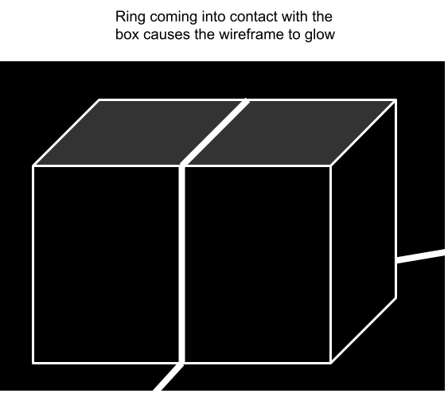

The ring should appear either if the clicker is used, or if an object collides. We aren’t detecting sound since detecting collisions is more reliable. For example if the player drops a book from a great height, a ring originates from the point of collision and spreads across the room. For interactable objects, the entire wireframe will not be used, but instead the basic outlining.

### 3D Models

Name

Potential Candidates

Notes

Resources So Far.

Vr controllers

*   [https://sketchfab.com/3d-models/vr-controllers-62a28358b08940908970959686728b4a](https://www.google.com/url?q=https://sketchfab.com/3d-models/vr-controllers-62a28358b08940908970959686728b4a&sa=D&source=editors&ust=1677800504124637&usg=AOvVaw0EHLXWH4XjzRqcJLxMhHSH) 
*   [https://sketchfab.com/3d-models/htc-vive-controller-f9cc5f021c044a25b2c89029448d9602](https://www.google.com/url?q=https://sketchfab.com/3d-models/htc-vive-controller-f9cc5f021c044a25b2c89029448d9602&sa=D&source=editors&ust=1677800504125153&usg=AOvVaw3fAmWJC-Gi4mlLZlcaNlwA) 

Using the vr controllers in place of the hands, makes it easier to navigate the controls

3

Key

*   [https://sketchfab.com/3d-models/attack-on-titan-erens-basement-key-a5849aab036a4c88903681fe1a1caa85](https://www.google.com/url?q=https://sketchfab.com/3d-models/attack-on-titan-erens-basement-key-a5849aab036a4c88903681fe1a1caa85&sa=D&source=editors&ust=1677800504126391&usg=AOvVaw19qT8fQDqRIWK16MlBS5YH) 

The key needs a somewhat unique silhouette.

2

Safe (with keypad)

*   [https://sketchfab.com/3d-models/keypadsafe-5cefbcd785d14a22bf4fbb5e18a2307d](https://www.google.com/url?q=https://sketchfab.com/3d-models/keypadsafe-5cefbcd785d14a22bf4fbb5e18a2307d&sa=D&source=editors&ust=1677800504129474&usg=AOvVaw1HYET4ZB3bJxMAD0k5SeZZ) 

Needs to have a keypad with blank keys (required for the challenge of the puzzle)

1

Clicker

*   [https://sketchfab.com/3d-models/vr-controllers-62a28358b08940908970959686728b4a](https://www.google.com/url?q=https://sketchfab.com/3d-models/vr-controllers-62a28358b08940908970959686728b4a&sa=D&source=editors&ust=1677800504131577&usg=AOvVaw3RRZjFcTMnoa7UZbcyaTvD) 

Since we’re using the actual controllers in place of hands, we just need a clicker that appears on the ground ready to be picked up.

1

Book

*   Making custom book model

One of the books are required to have a carving on the back of it (for the second puzzle)

1

Generic furniture

*   [https://sketchfab.com/3d-models/simple-chair-0efe6f9479c044cda34265b75b067704](https://www.google.com/url?q=https://sketchfab.com/3d-models/simple-chair-0efe6f9479c044cda34265b75b067704&sa=D&source=editors&ust=1677800504136316&usg=AOvVaw3xlaR4EUwe5CIOJCsLHu8Q)
*   [https://sketchfab.com/3d-models/table-846d8f2c2e3f4df78ca587bd6be657f8](https://www.google.com/url?q=https://sketchfab.com/3d-models/table-846d8f2c2e3f4df78ca587bd6be657f8&sa=D&source=editors&ust=1677800504137170&usg=AOvVaw0nj2nc1F8_Dvww1SY53c5X) 
*   [https://sketchfab.com/3d-models/bookshelf-1bcdd7c9c4544e27bcf9a31e47e60803](https://www.google.com/url?q=https://sketchfab.com/3d-models/bookshelf-1bcdd7c9c4544e27bcf9a31e47e60803&sa=D&source=editors&ust=1677800504137850&usg=AOvVaw1y8J_vGO916NbSbuaWeZAU)

stuff like chairs, bookshelves, desks/tables. Stuff to clutter up the room and make it harder to look for clues

4

Doors

*   Making a door model

Entrances such as Doors, vents or other passageways for character movement.

1

Puzzle Elements.

*   [https://sketchfab.com/3d-models/push-button-switch-on-base-eddc9540f6bf4f0c8b194c9334091d34](https://www.google.com/url?q=https://sketchfab.com/3d-models/push-button-switch-on-base-eddc9540f6bf4f0c8b194c9334091d34&sa=D&source=editors&ust=1677800504142047&usg=AOvVaw3-1loQmghnNup_syyhB5Yl) 

1

## Research & Development

Testing Project: [https://github.com/Lake-Tuggeranong-College/2023-ISD/tree/main/VR%20Test%20Project](https://www.google.com/url?q=https://github.com/Lake-Tuggeranong-College/2023-ISD/tree/main/VR%2520Test%2520Project&sa=D&source=editors&ust=1677800504144533&usg=AOvVaw1mnBCUUfDU2HCpTLH4MmCI)

Helper Lib: [https://godotvr.github.io/godot-xr-tools/](https://www.google.com/url?q=https://godotvr.github.io/godot-xr-tools/&sa=D&source=editors&ust=1677800504145196&usg=AOvVaw35oa7EstviA1aAlT8VrO2V)

Demo Video: [https://drive.google.com/file/d/1fSVnmbxUU9a7o\_zAHqzzgSMmlh\_QKP2k/view](https://www.google.com/url?q=https://drive.google.com/file/d/1fSVnmbxUU9a7o_zAHqzzgSMmlh_QKP2k/view&sa=D&source=editors&ust=1677800504145778&usg=AOvVaw3cjiHlQNYN4EvvZVKv-df2)

 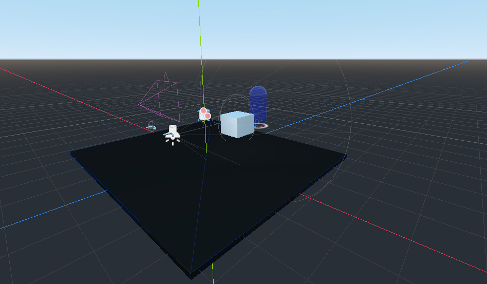

Over the next semester we are making a Virtual Reality escape room game where the player is blind. The only way for the player to be able to see anything inside of the room is through the use of sound. For this project to even take off, Dylan and Myself had to research the basic mechanics of a VR game and implement them as the start of our project.

The First mechanic that we researched and successfully implemented into our game is player teleportation, player teleportation allows the player to ‘teleport’ on the predefined area, in this case the floor. Having found VR tools in godot we were easily able to add teleportation using the provided code from godot. To implement the teleportation mechanic  we followed the VR tools provided by Godot. To implement this mechanic into the game we first had to determine which hand would be our teleporter, we chose the left hand as the hole and sole source of teleportation as the other hand would be used for other mechanics that will be implemented at a later point in time.

Once we successfully implemented player teleportation we discussed how the teleportation should look, we came up with the idea to ‘hide’ both the trajectory line when teleporting and the player model preview when teleporting normally, as the player is blind having a visible preview of the player model and trajectory line when teleporting took away from the atmosphere that we are attempting to create in this game, so to help fit the theme of the game and allow the player to find the boundaries of the level we left the small circle preview when teleporting.

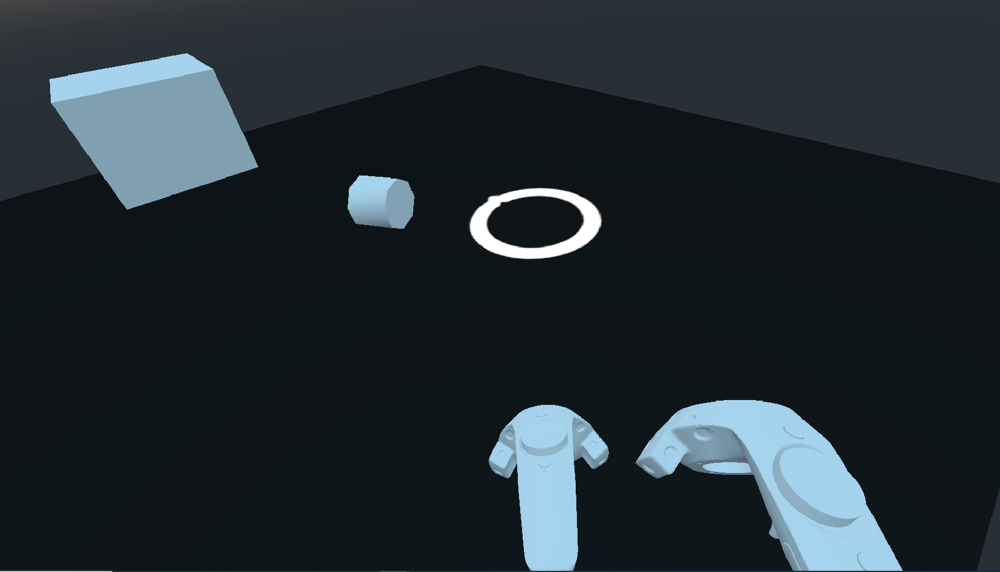

The next implementation that we added to our game is the ability to pick up and move objects. As the player will need to solve puzzles to escape we implemented moveable objects that will act as part of the puzzles in the future. We plan to ‘hide’ the objects when the player goes to grab them to fit with the theme of being blind, however we are also planning to implement the ability to view parts of the object when the player uses sound to view an area.

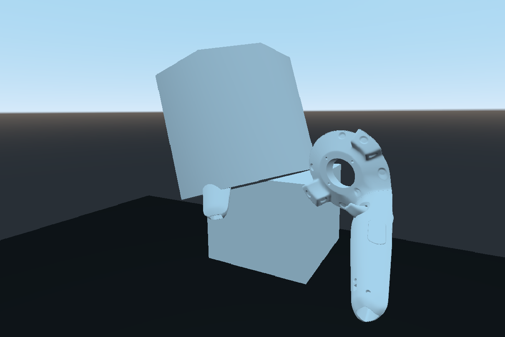

Once we got some of the basic mechanics implemented we made the player ‘blind’. To create the illusion of being blind we changed the colour of the environment and the background to black which made the player ‘blind’.

After the player was ‘blinded’ we started to implement a way for the player to progress through the puzzles, the first step of this was to allow the player to snap two objects together which will allow for a code to remove a door/ path blocker and let the player progress to either a new level or a new area of that level.

## Environment & Puzzles

### Environment

A two room environment. The first room is approximately  2m x 2m, about the size of a cleaning cupboard. In the top right corner, water drips from the roof into a puddle, creating a droplet sound, brightening the surroundings. This immediately teaches the player about the game’s main mechanic/theme.

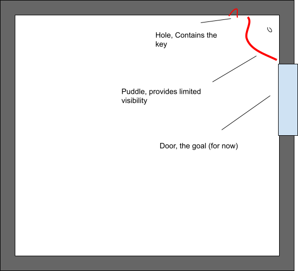

The right wall has a door that is only slightly visible (the doorknob should just be visible, due to the water droplet). The top wall has a small hole in it (visible via the water droplets), within it is the key to the door. The other walls have no other defining features.
 

The Second Room is significantly larger than the first and filled with multiple objects (red herrings, stuff that makes the room busier and more stuffy).

The numbers on the keypad will not be visible, creating a slightly bigger challenge. Numbers that give hints to the code can be found throughout the room (formatted like this, 1 = 4, 2 = 9, ect). The first number is found on the back wall off to right, carved onto the wall. The second number is found behind the safe. This requires the safe to be pulled out (a piece of paper could be stuck between the safe and wall, so that gives a hint). The Third number is carved on the back of the door the player enters through. The fourth and last number is carved on the back of the book found underneath the table.

## Controls and Movement

Sound creates a wireframe visualisation of objects it hits, with a donut shaped lightsource extending out from where sound was created. The donut light will dissipate after 5 seconds, with all wireframes revealed lasting for another 2 seconds. Using the trackpad activates the clicker to see around the map.

The right trigger allows the Player to teleport to another location with there being a highlighted ring showing where the Player will go.To hold and grab objects the left trigger has to be held down to work. In the future there might be other controls included in the game later during the development stage but for now this is what we have for now.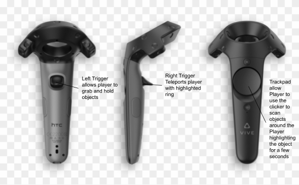

## Menus
-----

In the game there is going to be 1 main menu, 1 option menu and 1 in game menu for the player to use while they are in the game.

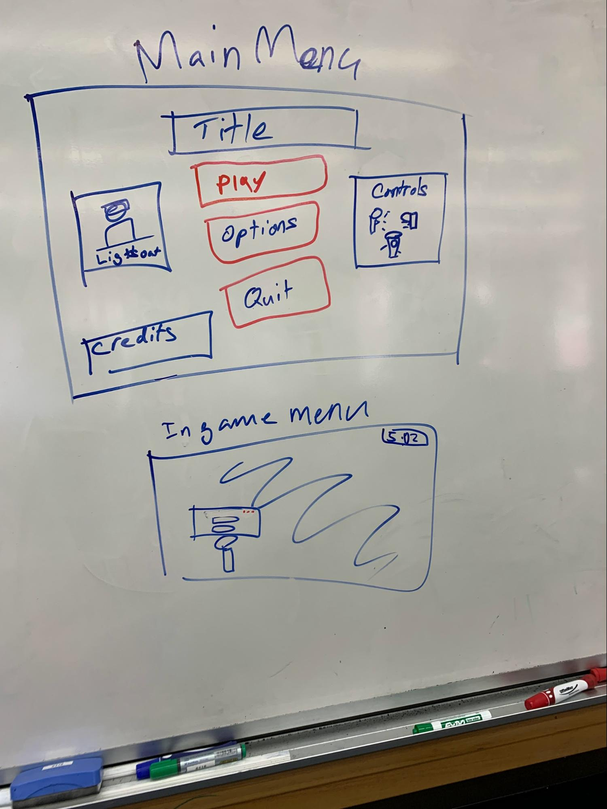

The title is going to have the name of the game in Oswald font.

Oswald font will also be used for the buttons in the menus  

The main menu is the first thing you see when you first load into lights out. The main menu has 4 actions/buttons that you can interact with. The play button that you can see in that image is the button that takes you to the game itself.

The option button takes you to the options menu screen here

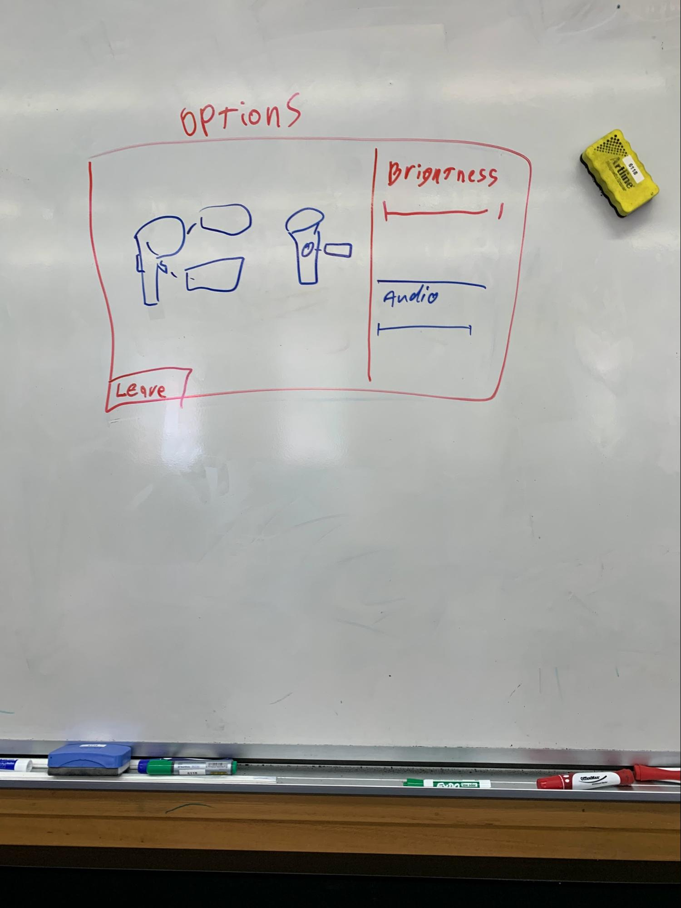

In the option menu you can change the brightness of the game and the audio level of the game, while you are in the option menu you can also see the controls for the game. In the bottom left hand corner you can see a leave button. You can press that button to go back to the main menu.

Back on the main menu (pg:15 to see image of the main menu) you can see a button under options button that button says quit when this button is clicked you will leave the game

The player can access the credits by pressing the credits button in the bottom left hand corner of the main menu. In the credits it will scroll down to show who has work on this project and the link to the models we used for this game  

Eg of credits

Is what the credits will look like, while you are in the credits you can press the esc key on your keyboard to return to the main menu

When the player is in the game they can press the (button) to open a in game menu

In game menu eg

## Resources with links.

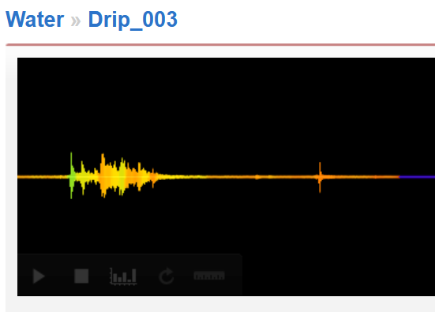

Jamesables. (2012). Drip\_003 \[Song\]. FreeSound. [https://freesound.org/people/jamesabels/sounds/166950/](https://www.google.com/url?q=https://freesound.org/people/jamesabels/sounds/166950/&sa=D&source=editors&ust=1677800504161717&usg=AOvVaw39_GKvpC8z9DkJ82FPaOGp) CC0 1.0.

*   Reference approved?
*   Used?

I thought that the water should be a repeatable sound as this sound will be used primarily for getting the player used to the environment and how sound works.

Also wanted it to be repeatable so that making sound ripple effects with this file is easier.

This file is labelled in the game’s Audio Files as WaterDrip\_SFX.wav

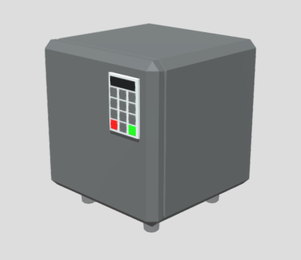

Law, J. (2022). KeypadSafe \[3D Model\]. Sketchfab. [https://sketchfab.com/3d-models/keypadsafe-5cefbcd785d14a22bf4fbb5e18a2307d](https://www.google.com/url?q=https://sketchfab.com/3d-models/keypadsafe-5cefbcd785d14a22bf4fbb5e18a2307d&sa=D&source=editors&ust=1677800504166245&usg=AOvVaw0nGLZET9dv77I_ODk6Gkvq) CC BY 4.0.

*   Reference approved?
*   Used?

The end goal of the first room puzzle (in the basement), unlockable with a keypad number code hidden among parts of the basement. Safe door still needs to be checked if it can open.

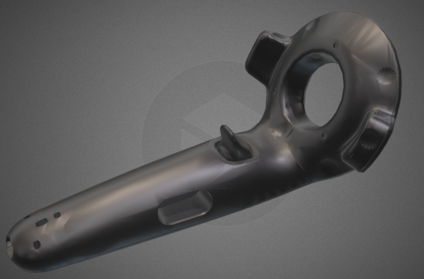

Romero, M. (2017). HTC Vive Controller \[3D Model\]. Sketchfab. [https://sketchfab.com/3d-models/htc-vive-controller-7199d01cef484c7ba67e0cf8ca690d97](https://www.google.com/url?q=https://sketchfab.com/3d-models/htc-vive-controller-7199d01cef484c7ba67e0cf8ca690d97&sa=D&source=editors&ust=1677800504170936&usg=AOvVaw1FgxPRcc-5Cj_NSRu4eM4J) CC BY 4.0.

*   Reference approved?
*   Used?

A previous version of the Controller used for the game, however a newer version is discussed to be used for the final version. This resource will still be here listed in case it is used.

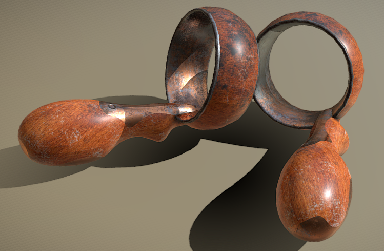

jvouillon. (2020). VR Controllers \[3D Model\]. Sketchfab. [https://sketchfab.com/3d-models/vr-controllers-62a28358b08940908970959686728b4a](https://www.google.com/url?q=https://sketchfab.com/3d-models/vr-controllers-62a28358b08940908970959686728b4a&sa=D&source=editors&ust=1677800504174949&usg=AOvVaw2xKgGAnZmaX1qCB3IDSmG8) CC BY 4.0.

*   Reference approved?
*   Used?

A simplistic variant of the Vr Controllers, meant for Oculus compatibility, the main reason this resource is listed is because of the texture it has with the main rustic theme of the game.

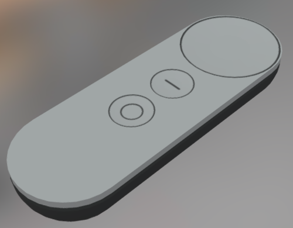

rje. (2016). Daydream Vr Controller \[3D Model\]. Sketchfab. [https://sketchfab.com/3d-models/vr-controllers-62a28358b08940908970959686728b4a](https://www.google.com/url?q=https://sketchfab.com/3d-models/vr-controllers-62a28358b08940908970959686728b4a&sa=D&source=editors&ust=1677800504177920&usg=AOvVaw1jfksTfTtQx1i_SeqrWI0G) CC BY 4.0.

*   Reference approved?
*   Used?

A child friendly clicker with straight forward buttons and a non-complex design. What I would believe to be a air conditioner controller now serves the purpose of a sound emitter.

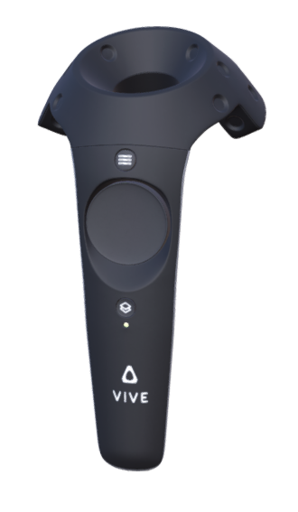

serkanmert. (2016). htc vive controller \[3D Model\]. Sketchfab. [https://sketchfab.com/3d-models/htc-vive-controller-f9cc5f021c044a25b2c89029448d9602](https://www.google.com/url?q=https://sketchfab.com/3d-models/htc-vive-controller-f9cc5f021c044a25b2c89029448d9602&sa=D&source=editors&ust=1677800504180359&usg=AOvVaw3qeur2-QPqSEM0T_4Lrr72) CC BY 4.0.

*   Reference approved?
*   Used?

The most recent model of the HTC Vive Controllers used for the ‘Lights Out’ demo. The hands within the game will not be realistic, as the game is made to be user-friendly.

King, S. (2020). Door key \[3D Model\]. Sketchfab. [https://sketchfab.com/3d-models/door-key-834f4e75590d432f96bc97be5065f6f6](https://www.google.com/url?q=https://sketchfab.com/3d-models/door-key-834f4e75590d432f96bc97be5065f6f6&sa=D&source=editors&ust=1677800504182991&usg=AOvVaw0raOV1MStLZUK4AkLTSbby) CC BY 4.0.

*   Reference approved?
*   Used?

A classic door key, ideal for bringing more immersion to the environment.

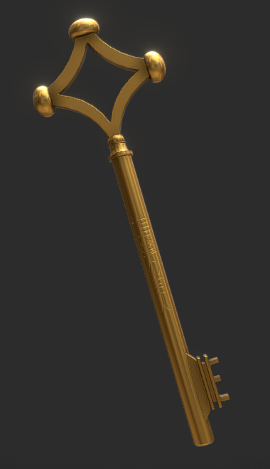

Aerin. (2021). Attack on Titan (Eren's Basement Key) \[3D Model\]. Sketchfab. [https://sketchfab.com/3d-models/attack-on-titan-erens-basement-key-a5849aab036a4c88903681fe1a1caa85](https://www.google.com/url?q=https://sketchfab.com/3d-models/attack-on-titan-erens-basement-key-a5849aab036a4c88903681fe1a1caa85&sa=D&source=editors&ust=1677800504185541&usg=AOvVaw35yOh0lRzypOLF3kw765pm) CC BY 4.0

*   Reference approved?
*   Used?

A unique and fantasy-like key inspired from Attack on Titan, with a very noticeable design as a key, making it ideal for new or non-key-aligned players.

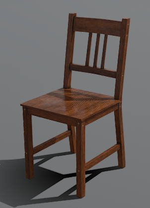

MrFreeman. (2019). Simple Chair \[3D Model\]. Sketchfab. [https://sketchfab.com/3d-models/simple-chair-0efe6f9479c044cda34265b75b067704](https://www.google.com/url?q=https://sketchfab.com/3d-models/simple-chair-0efe6f9479c044cda34265b75b067704&sa=D&source=editors&ust=1677800504187844&usg=AOvVaw0M4ULpKIqFrfvUG9FvwC6B) CC BY 4.0

*   Reference approved?
*   Used?

A classic brown rustic chair. Not a particularly comfortable chair, but a chair nonetheless. A kitchen chair best suits this model.

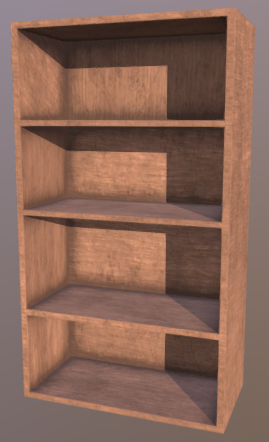

Steiner, K. (2019). Bookshelf \[3D Model\]. Sketchfab. [https://sketchfab.com/3d-models/bookshelf-1bcdd7c9c4544e27bcf9a31e47e60803](https://www.google.com/url?q=https://sketchfab.com/3d-models/bookshelf-1bcdd7c9c4544e27bcf9a31e47e60803&sa=D&source=editors&ust=1677800504190234&usg=AOvVaw2KJmirHcFNdOQ7duRu7rSl) CC BY 4.0

*   Reference approved?
*   Used?

A proper bookshelf with no hidden passageways whatsoever. An ideal model for a puzzle element, housing texts of mysteries.

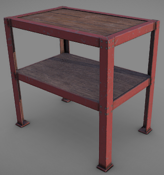

Shedmon. (2020). Table \[3D Model\]. Sketchfab. [https://sketchfab.com/3d-models/table-846d8f2c2e3f4df78ca587bd6be657f8](https://www.google.com/url?q=https://sketchfab.com/3d-models/table-846d8f2c2e3f4df78ca587bd6be657f8&sa=D&source=editors&ust=1677800504192900&usg=AOvVaw2Z5flCYy7VvMJz0rhzGw_r) CC BY 4.0

*   Reference approved?
*   Used?

A double-decker table (technically a shelf) made to carry possibly important items and sit in the middle of rooms without reason.

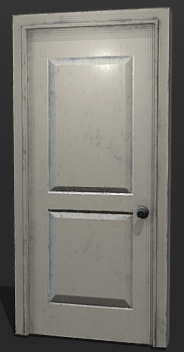

Zian. (2020). Door \[3D Model\]. Sketchfab. [https://sketchfab.com/3d-models/door-d23ec435af454cf985292778dbd65c9e](https://www.google.com/url?q=https://sketchfab.com/3d-models/door-d23ec435af454cf985292778dbd65c9e&sa=D&source=editors&ust=1677800504194983&usg=AOvVaw0q4-tRGRZmx9qyQLWG2cg7) CC BY 4.0

*   Reference approved?
*   Used?

A classic old door, one of many to be utilised to scan environments and peek around.

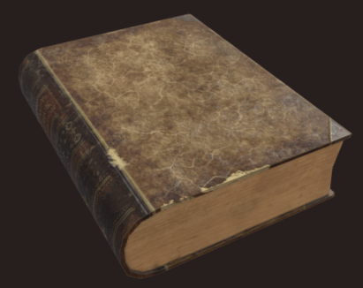

Dejnes, E. (2019). Antique Leather Book Big \[3D Model\]. Sketchfab. [https://sketchfab.com/3d-models/antique-leather-book-big-f62314240a0140a89e29119829aec000](https://www.google.com/url?q=https://sketchfab.com/3d-models/antique-leather-book-big-f62314240a0140a89e29119829aec000&sa=D&source=editors&ust=1677800504197010&usg=AOvVaw2RjwdPAfSpjpbkGDVNgIQv) CC BY 4.0

*   Reference approved?
*   Used?

An old leather book, unfortunately without it’s marking on the back (specified for a puzzle element). However it maintains the rustic theme.

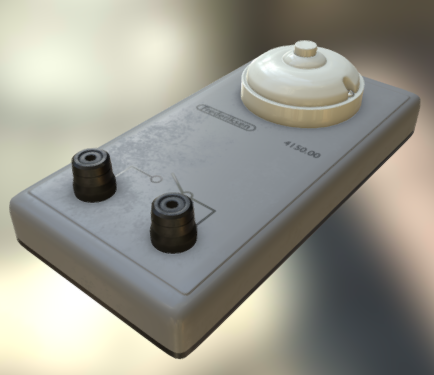

kerouac9. (2017). Push button switch on base \[3D Model\]. [https://sketchfab.com/3d-models/push-button-switch-on-base-eddc9540f6bf4f0c8b194c9334091d34](https://www.google.com/url?q=https://sketchfab.com/3d-models/push-button-switch-on-base-eddc9540f6bf4f0c8b194c9334091d34&sa=D&source=editors&ust=1677800504199407&usg=AOvVaw2aU1FlKp79WP9V4q4HuDHL) CC BY 4.0

*   Reference approved?
*   Used?

A doorbell-like button with a seemingly complex design collected for a puzzle within ‘Lights Out’.

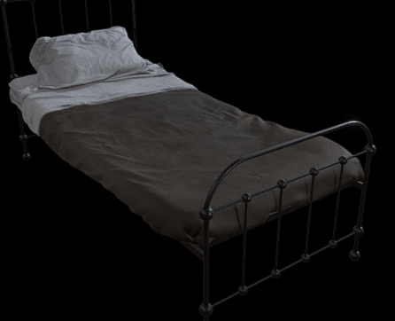

XR Connections. (2019). Bed \[3D Model\]. [https://sketchfab.com/3d-models/bed-b0aa0259376b435fab6645365a7fbd87](https://www.google.com/url?q=https://sketchfab.com/3d-models/bed-b0aa0259376b435fab6645365a7fbd87&sa=D&source=editors&ust=1677800504201682&usg=AOvVaw0dUnAnc7HxshIsBJYcN_XJ) CC BY 4.0

*   Reference approved?
*   Used?

An old rustic bed. Could be used within the basement (first level) to give story to the antagonists / immerse the player in the environment.

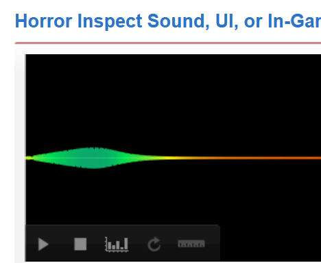

MATRIXXX\_. (2022). Horror Inspect Sound, UI, or In-Game Notification 01.wav \[Song\]. FreeSound. [https://freesound.org/people/MATRIXXX\_/sounds/657947/](https://www.google.com/url?q=https://freesound.org/people/MATRIXXX_/sounds/657947/&sa=D&source=editors&ust=1677800504203767&usg=AOvVaw06uRBkDPdt-img17le-H4I) CC0 1.0.

*   Reference approved?
*   Used?

A horror themed UI notification, designed for an immersive environment, unfortunately it is naturally quiet, may need to be altered to be louder.

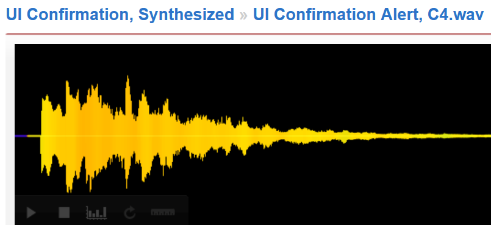

InspectorJ. (2017). UI Confirmation Alert, C4.wav \[Song\]. FreeSound. [https://freesound.org/people/InspectorJ/sounds/403019/](https://www.google.com/url?q=https://freesound.org/people/InspectorJ/sounds/403019/&sa=D&source=editors&ust=1677800504205984&usg=AOvVaw1J3Rh_72Wv17cpkCuEx799) CC BY 4.0.

*   Reference approved?
*   Used?

This file is labelled in the game’s Audio Files as UI\_confirmation\_Optimistic.

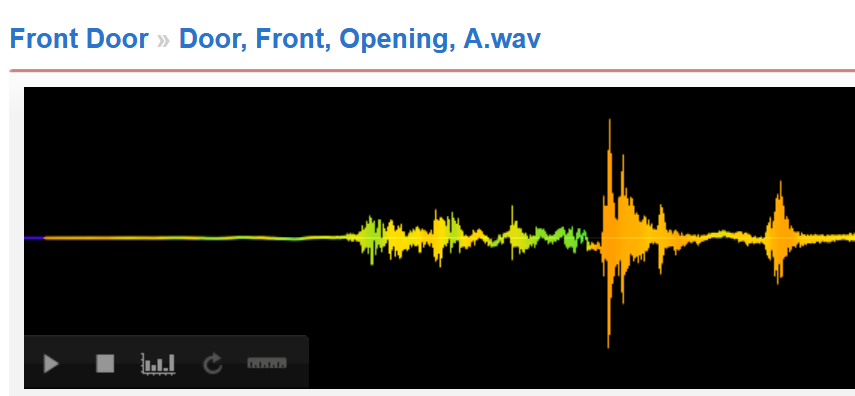

InspectorJ. (2018). Door, Front, Opening, A \[Song\]. FreeSound. [https://freesound.org/people/InspectorJ/sounds/431117/](https://www.google.com/url?q=https://freesound.org/people/InspectorJ/sounds/431117/&sa=D&source=editors&ust=1677800504208322&usg=AOvVaw3cVknSoqWuyA6yh_T5W-KX) CC BY 4.0.

*   Reference approved?
*   Used?

Despite this being labelled as a door opening sound, this is actually just the sound of a door’s locks being unlocked.

This file is labelled in the game’s Audio Files as DoorLook\_Unlocking\_SFX.wav

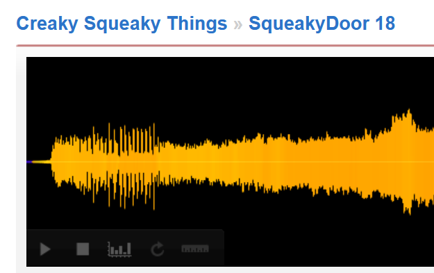

Department64. (2022). SqueakyDoor 18 \[Song\]. FreeSound. [https://freesound.org/people/Department64/sounds/661759/](https://www.google.com/url?q=https://freesound.org/people/Department64/sounds/661759/&sa=D&source=editors&ust=1677800504210664&usg=AOvVaw0qS2dzqTxEZsCsOyjsKdK3) CC BY 4.0.

*   Reference approved?
*   Used?

A classic sound effect for an old creaking door.

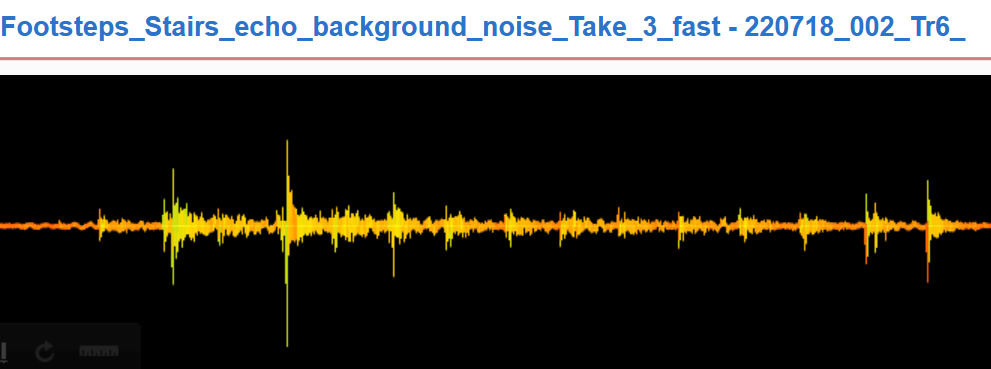

TSP-Talk. (2022). Footsteps\_Stairs\_echo\_background\_noise\_Take\_3\_fast - 220718\_002\_Tr6\_ \[Song\]. FreeSound. [https://freesound.org/people/TSP-Talk/sounds/643041/](https://www.google.com/url?q=https://freesound.org/people/TSP-Talk/sounds/643041/&sa=D&source=editors&ust=1677800504212672&usg=AOvVaw1utmiJIyflKhJuYe5UFLye) CC0 1.0.

*   Reference approved?
*   Used?

Footsteps just quiet enough to count as background noise, usable for npc movement.

This file is labelled in the game’s Audio Files as FootstepsBackground\_SFX.wav

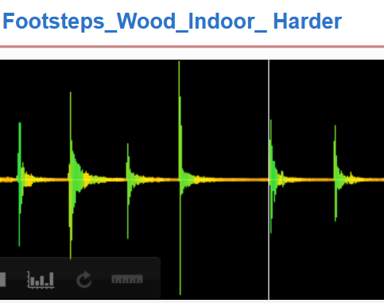

Svyato. (2017). Footsteps\_Wood\_Indoor\_ Harder \[Song\]. FreeSound. [https://freesound.org/people/Svyato/sounds/404800/](https://www.google.com/url?q=https://freesound.org/people/Svyato/sounds/404800/&sa=D&source=editors&ust=1677800504215372&usg=AOvVaw2K7ef7ZvN_InsApTIFvjXx) CC0 1.0.

*   Reference approved?
*   Used?

Footsteps of the protagonist, clearly heard on the hardwood floor. Could be used for the intro stairs sequence.

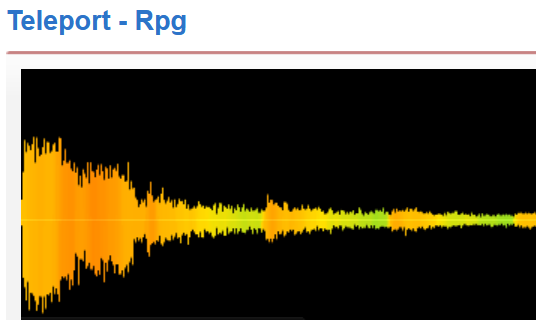

colorsCrimsonTears. (2021). Teleport - Rpg \[Song\]. FreeSound. [https://freesound.org/people/colorsCrimsonTears/sounds/563542/](https://www.google.com/url?q=https://freesound.org/people/colorsCrimsonTears/sounds/563542/&sa=D&source=editors&ust=1677800504217825&usg=AOvVaw2JDrE4J2BcT2DWJp3AdV_C) CC0 1.0.

*   Reference approved?
*   Used?

A short (progressively quieter) sci-fi noise for teleportation. Could be too sci-fi, needs to be checked.

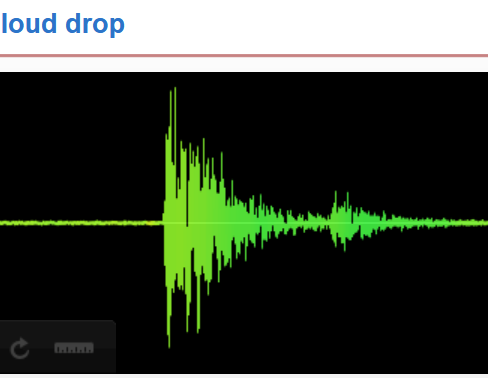

Jarebear1223. (2022). Loud drop \[Song\]. FreeSound. [https://freesound.org/people/Jarebear1223/sounds/618529/](https://www.google.com/url?q=https://freesound.org/people/Jarebear1223/sounds/618529/&sa=D&source=editors&ust=1677800504220045&usg=AOvVaw1gFWxB8LYZauE1YvPhjdpJ) CC0 1.0.

*   Reference approved?
*   Used?

A short impact noise for some item dropping hard onto the floor.

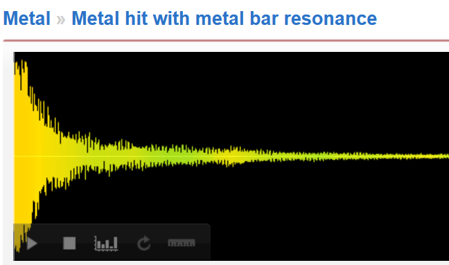

Jorickhoofd. (2012). Metal hit with metal bar resonance \[Song\]. FreeSound. [https://freesound.org/people/jorickhoofd/sounds/160045/](https://www.google.com/url?q=https://freesound.org/people/jorickhoofd/sounds/160045/&sa=D&source=editors&ust=1677800504222467&usg=AOvVaw3ojahWHv9gq55R7ympuObn) CC BY 4.0.

*   Reference approved?
*   Used?

A high pitched metal sound, the impact sound made from crashing metal. A classic “donk” sound.

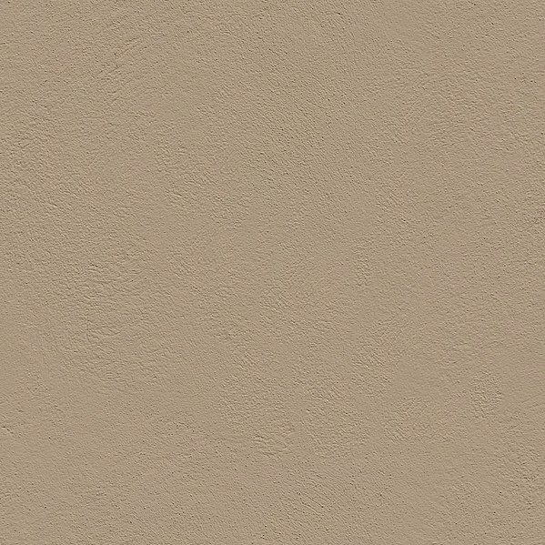

Sisters.seamless. (2020). Beige tan sand faced finish clean seamless building wall texture \[Photograph\]. Wikimedia Commons. [https://commons.wikimedia.org/wiki/File:Beige\_tan\_sand\_faced\_finish\_clean\_seamless\_building\_wall\_texture.jpg](https://www.google.com/url?q=https://commons.wikimedia.org/wiki/File:Beige_tan_sand_faced_finish_clean_seamless_building_wall_texture.jpg&sa=D&source=editors&ust=1677800504224532&usg=AOvVaw02Ok5ueT03uKvgYgGB806z) CC0 1.0.

*   Reference approved?
*   Used?

Text description

Seier+seier. (2010). Seier+seier free concrete texture, seamless libeskind judische museum, seier+seier \[Photograph\]. Flickr. [https://www.flickr.com/photos/seier/4338268272](https://www.google.com/url?q=https://www.flickr.com/photos/seier/4338268272&sa=D&source=editors&ust=1677800504226537&usg=AOvVaw1fMsf58KNZJlNX6Su0eD9k) CC BY 2.0.

*   Reference approved?
*   Used?

Text description

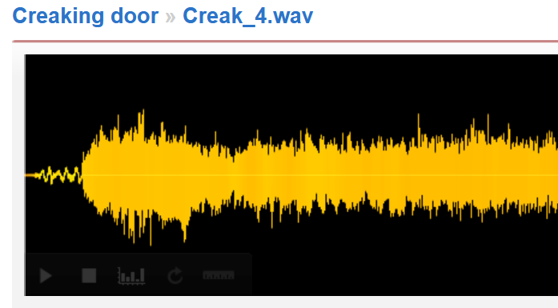

Boland, H. (2007). Creak\_4 \[Song\]. FreeSound. [https://freesound.org/people/HerbertBoland/sounds/29691/](https://www.google.com/url?q=https://freesound.org/people/HerbertBoland/sounds/29691/&sa=D&source=editors&ust=1677800504229240&usg=AOvVaw1qpTOtefrE3Zxjoxw5fU-v) CC BY 4.0.

*   Reference approved?
*   Used?

This file is labelled in the game’s Audio Files as Door\_CreakSound.wav

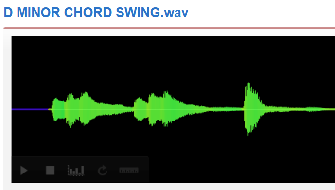

djfroyd. (2019). D MINOR CHORD SWING \[Song\]. FreeSound. [https://freesound.org/people/djfroyd/sounds/462464/](https://www.google.com/url?q=https://freesound.org/people/djfroyd/sounds/462464/&sa=D&source=editors&ust=1677800504235711&usg=AOvVaw1e4ttobMdhZoWPWLA-P69C) CC BY 3.0

*   Reference approved?
*   Used?

This file is labelled in the game’s Audio Files as UI\_confirmation\_Sinister.wav

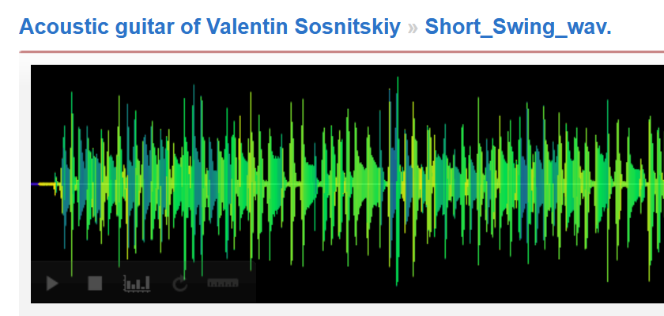

Sosnitskiy, V. (2015). Short\_Swing \[Song\]. Freesound. [https://freesound.org/people/ValentinSosnitskiy/sounds/317463/](https://www.google.com/url?q=https://freesound.org/people/ValentinSosnitskiy/sounds/317463/&sa=D&source=editors&ust=1677800504239418&usg=AOvVaw2EVmKHGzzGjQIWRGxEdLha) CC BY 4.0.

*   Reference approved?
*   Used?

This file is labelled in the game’s Audio Files as Mafia\_Jukebox.wav

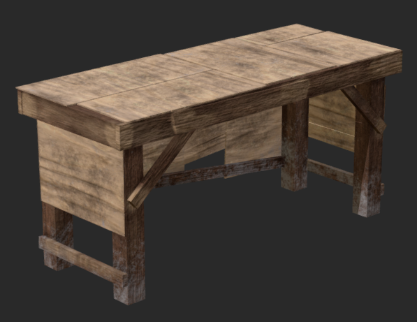

Sharma, P. (2019). Wooden Table \[3D Model\]. Sketchfab. [https://sketchfab.com/3d-models/wooden-table-8a5b41d6445c4f1fbefb2e4abfeebb0d](https://www.google.com/url?q=https://sketchfab.com/3d-models/wooden-table-8a5b41d6445c4f1fbefb2e4abfeebb0d&sa=D&source=editors&ust=1677800504243281&usg=AOvVaw2ibD5Ni_H9zy8WgZv5jIr-) CC BY 4.0

*   Reference approved?
*   Used?

This file is labelled in the game’s 3D Models as Wooden\_Makeshift\_Table.

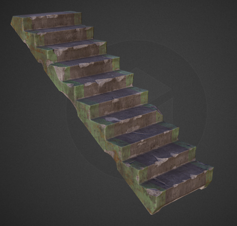

Azusa. (2018). Old Stairs \[3D Model\]. Sketchfab. [https://sketchfab.com/3d-models/old-stairs-0e6262f70f09499780c5383a37c80606](https://www.google.com/url?q=https://sketchfab.com/3d-models/old-stairs-0e6262f70f09499780c5383a37c80606&sa=D&source=editors&ust=1677800504247503&usg=AOvVaw04xapYpj4gwDVAnp01vWxy) CC BY 4.0

*   Reference approved?
*   Used?

This file is labelled in the game’s 3D Models as Old\_Stairs.

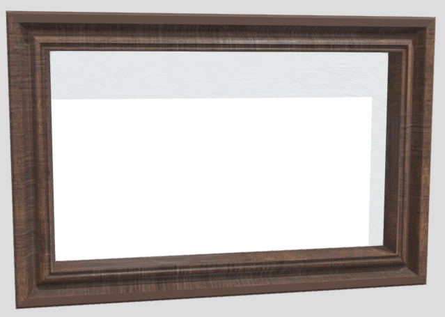

Wyme. (2019). Picture Frame \[3D Model\]. Sketchfab. [https://sketchfab.com/3d-models/picture-frame-5b4f6ab0cd54433c82b429b42f4c9259](https://www.google.com/url?q=https://sketchfab.com/3d-models/picture-frame-5b4f6ab0cd54433c82b429b42f4c9259&sa=D&source=editors&ust=1677800504251206&usg=AOvVaw2FMgJZTzxcpdjNMO4si1Fn) CC BY 4.0

*   Reference approved?
*   Used?

This file is labelled in the game’s 3D Models as Picture\_Frame. This model (implemented 27/02/23) was originally .dae, but has been found to work in Godot 3.5.1.

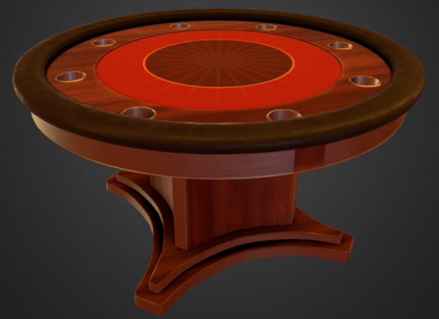

thethieme. (2015). Pokertable Round \[3D Model\]. Sketchfab. [https://sketchfab.com/3d-models/pokertable-round-5c335b7eff684213bd955b05ef90a354](https://www.google.com/url?q=https://sketchfab.com/3d-models/pokertable-round-5c335b7eff684213bd955b05ef90a354&sa=D&source=editors&ust=1677800504255074&usg=AOvVaw1qb-BozjRuL4tmFT6fdjaS) CC BY 4.0

*   Reference approved?
*   Used?

This file is labelled in the game’s 3D Models as Poker\_Table.

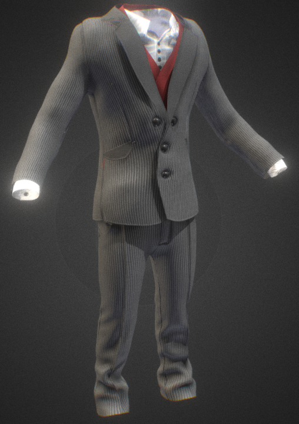

DEYMAR. (2022). a set of classic "mafia" costume \[3D Model\]. Sketchfab. [https://sketchfab.com/3d-models/a-set-of-classic-mafia-costume-78a554a4813f4a07be3479d84aefe678](https://www.google.com/url?q=https://sketchfab.com/3d-models/a-set-of-classic-mafia-costume-78a554a4813f4a07be3479d84aefe678&sa=D&source=editors&ust=1677800504258828&usg=AOvVaw1xIghhOottsWYKD2yopel_) CC BY 4.0

*   Reference approved?
*   Used?

This file is labelled in the game’s 3D Models as MafiaStanding\_Model.

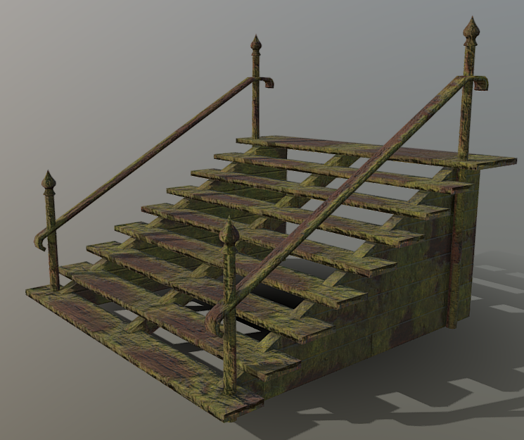

JGeidatzis. (2020). Mossy Wooden Stairs \[3D Model\]. Sketchfab. [https://sketchfab.com/3d-models/mossy-wooden-stairs-afb4d9581d004c90897650c8b511392e](https://www.google.com/url?q=https://sketchfab.com/3d-models/mossy-wooden-stairs-afb4d9581d004c90897650c8b511392e&sa=D&source=editors&ust=1677800504262445&usg=AOvVaw2JUFQxerlMGlZ7-hwHcrfM) CC BY-NC-SA 4.0

*   Reference approved?
*   Used?

This file is labelled in the game’s 3D Models as Mossy\_Stairs.

These stairs were added to the potentially usable stairs because of the weird collision that the past stairs had with the player not able to climb them, which we later fixed with ramp-like collision shapes.

*   Reference approved?
*   Used?

*   Reference approved?
*   Used?

## Ripple Effect

The current ripple effect looks like this:

It will only come out when the clicker is clicked. It gets smaller with time as you can see above. It has a radial gradient (a circular blob of colour in the middle that changes into another colour around it) so that the ripple will turn white over time like we had planned.

The ripple itself is actually called a sombrero ripple due to the fact that it looks like a sombrero with a tall and round centre with a smaller rim.

Once the ripple reaches an object we plan to have that object’s wireframe or border show up in white for the player to see.

The shader itself has a separate mini shader in it being the gradient. This is editable the same way as textures mixed with the way you’d edit an object, going to the gradient is the same as going to a texture however the editing process is more similar to an object where you change the X and Z values.

Be cautious with editing the object itself, if you remove subdivisions the ripple will change, this is the same for changing the size values of the plane itself.
