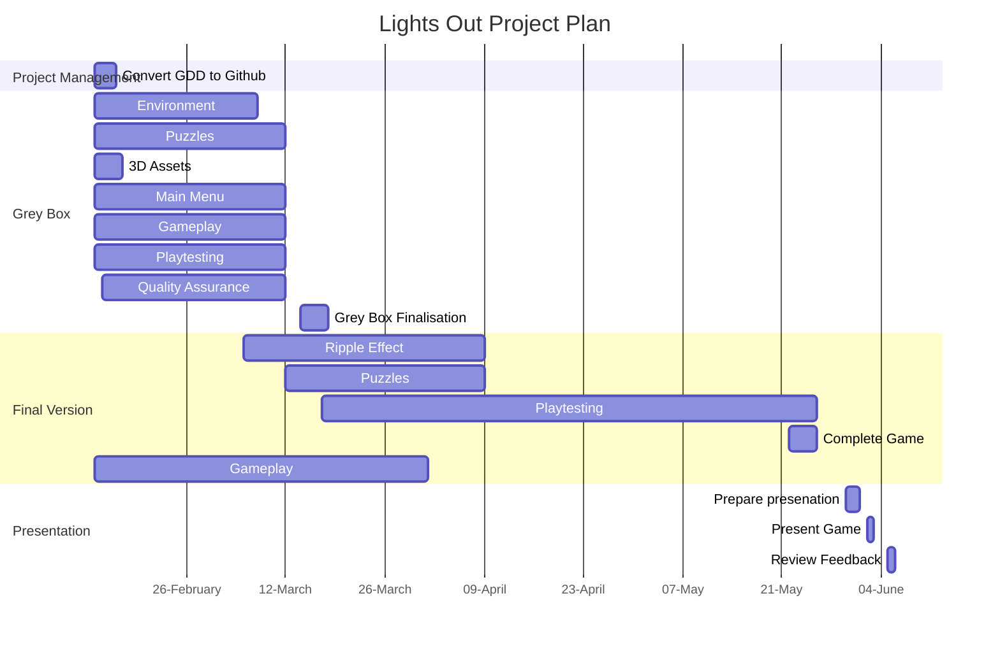

# Project Planning
v1 (15-02-23):

## Approval 
S.A
C.B
B.W
B.V

D.P

J.R

## Plan

## Instructions

To add your approval to this project plan. 
- Edit the document in your fork, 
- add your initials, 
- commit the change, 
- push the changes to your repository and 
- create a pull request.
- Profit.
