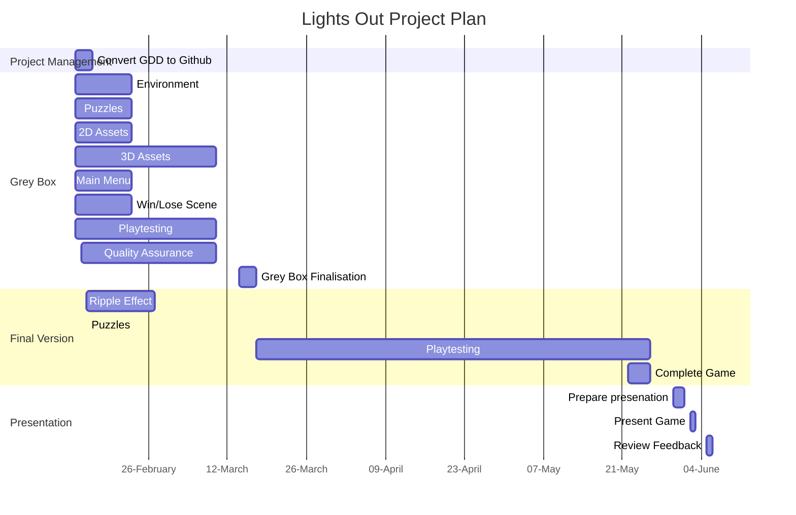

# Project Planning - DRAFT

## Approval 

v1 (insert Date):

## Plan

## Instructions

To add your approval to this project plan. 
- Edit the document in your fork, 
- add your initials, 
- commit the change, 
- push the changes to your repository and 
- create a pull request.
- Profit.